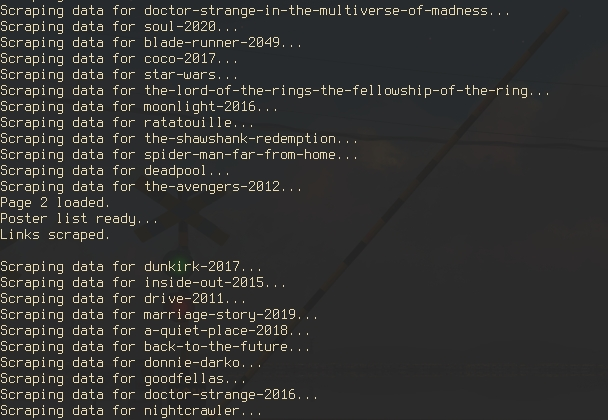
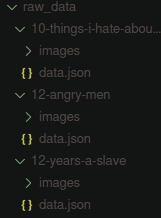
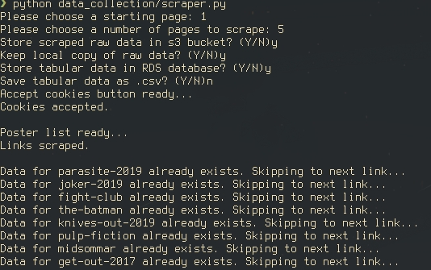
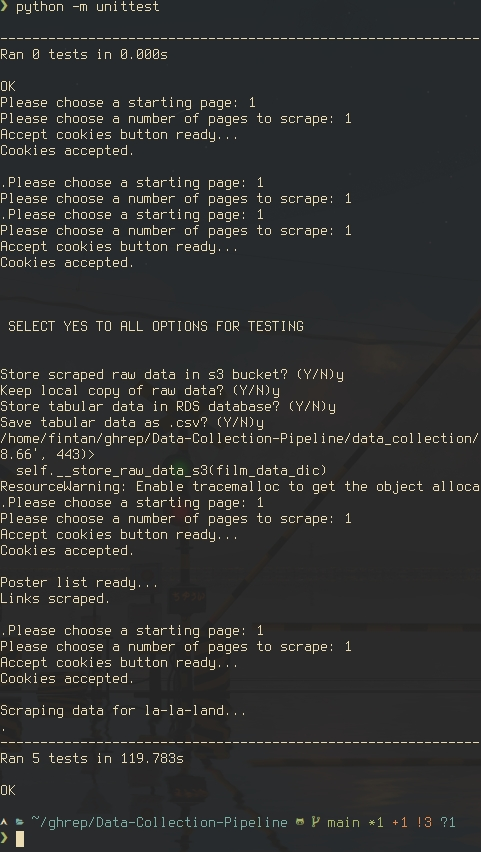
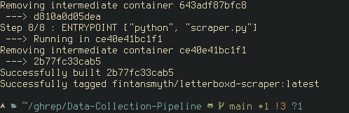
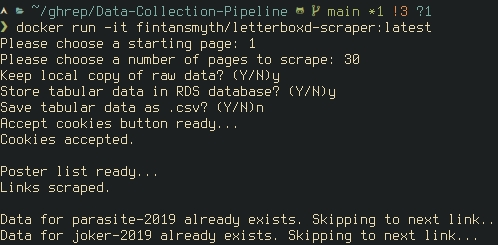
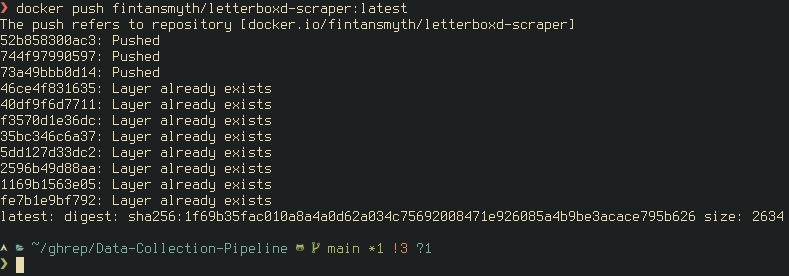

# Data-Collection-Pipeline

The task for this project is to create a data collection pipeline that will scrape data from a chosen website and scalably store it online. Ultimately a full data pipeline will be created including running the scraper on a cloud server and monitoring.

# Milestone 1

The task for the first milestone is to choose the website that I will scrape data from. The website should have a many items from which a good amount of similar datapoints can be obtained, ideally including images. Based on these criteria I chose the film comparison website Letterboxd.com as it has an extensive database of films, from which many different datapoints can be extracted such as title, release year, director as well as an image of the film's poster. 

# Milestone 2

The task for the second milestone is to start building my `scraper` class by creating methods to perform basic navigation of the website and obtain links to entries from which data can be scraped.

I started by creating a new file `scraper.py` and importing all the necessary modules I will need to run my scraper. The `scraper` class is then created and the `__init__` method is defined:
```python
from selenium import webdriver
from selenium.webdriver.support.ui import WebDriverWait
from selenium.webdriver.support import expected_conditions as EC
from selenium.webdriver.common.by import By
from selenium.webdriver.common.keys import Keys
from selenium.common.exceptions import TimeoutException
import time
import uuid
import json
import os
import requests


class scraper:

    def __init__(self, start_page = 1):
        self.driver = webdriver.Firefox()
        self.start_page = start_page
        self.start_url = f"https://letterboxd.com/films/popular/page/{self.start_page}"
        self.driver.get(self.start_url)
```
- The primary package I am importing from is `selenium`. Selenium webdriver is a tool that allows you to automatically drive a web browser and use it to interact with webpages. For this project I can use it to navigate my chosen website and extract data from the site's `html`.

- I then define the `scraper` class. It accepts one parameter `start_page` with a default value of 1. This dictates the first page of the `letterboxd.com/films/popular` category that the scraper will use to obtain links to film entries.
- A Firefox webdriver instance is called and assigned to the attribute `driver`.
- The `start_page` parameter is assigned to the `start_page` attribute.
- The string `'https://letterboxd.com/films/popular/page/{self.start_page}'` is formatted with the `start_page` attribute and assigned to the attribute `start_url`.
- The webdriver then loads the webpage assigned to `start_url`

---

The next method I defined is the `accept_cookies` method. Upon loading the website on a fresh browser a cookies notification pops up that prevents some website interaction, and so a method to close this should be created to allow the scraper to function.
```python
    def accept_cookies(self):
        delay = 10
        try:
            WebDriverWait(self.driver, delay).until(EC.presence_of_element_located((By.XPATH, '//*[@class="fc-button fc-cta-consent fc-primary-button"]')))
            print('Accept cookies button ready...')
            accept_cookies_button = self.driver.find_element(by=By.XPATH, value='//*[@class="fc-button fc-cta-consent fc-primary-button"]')
            accept_cookies_button.click()
            print('Cookies accepted.\n')
            return True
        except TimeoutException:
            print('Cookies button did not load in time.\n')
            return False
        time.sleep(1)
```
- The driver waits for the element containing the accept cookies button to appear.
- If it appears within the delay time the button to accept cookies is clicked and `Cookies accepted.` is printed in the terminal and the program continues.
- If the button does not load within the delay time `Cookies button did not load in time` is printed in the terminal and the program continues.

---

The next task is to define a method that will obtain links to film entries in the letterboxd database and store these links in a list. For this I created the method `get_film_links_from_single_page`, which will obtain all the links to film entries from a single page from letterboxd.com's popular section:
```python
    def get_film_links_from_single_page(self) -> list:
        delay = 10
        WebDriverWait(self.driver, delay).until(EC.presence_of_element_located((By.XPATH, '//*[@class="poster-list -p70 -grid"]/li')))
        print('Poster list ready...')
        film_container = self.driver.find_element(by=By.XPATH, value='//*[@class="poster-list -p70 -grid"]')
        film_list = film_container.find_elements(by=By.XPATH, value='./li')
        link_list = []

        for film in film_list:
            WebDriverWait(film, delay).until(EC.presence_of_element_located((By.TAG_NAME, 'a')))
            a_tag = film.find_element(By.TAG_NAME, 'a')
            link = a_tag.get_attribute('href')
            link_list.append(link)
        print('Links scraped.\n')
        return link_list
```
- First the driver waits for the poster list element containing links to load in.
- The list of elements containing film links is then extracted from its container and assigned to `film_list`
- `film_list` is then iterated through and for each element the `href` attribute containing a link to a film entry is extracted and appended to `link_list`.
- The method then returns `link_list`

Initially, I defined another method `get_film_links` that would navigate through a chosen number of pages and use `get_film_links_from_single_page` to build an extended list of the links from many pages. However, in testing significant slow down occurred as larger numbers of pages were scraped for links before scraping all links for data. Due to this I opted instead to scrape the data from all the links on a single page before navigating to the next page of film links. This improved performance when larger numbers of pages were chosen to be scraped for links and prevented a long initial step of scraping all chosen pages for links.

# Milestone 3

The goal of this milestone is to enable my scraper to extract data from the entries on letterboxd.com to which the scraper has obtained links and store that data locally. To do this I defined methods to scrape image and text data as well as a method to store the scraped image and text data in a local `raw_data` folder. The data extracted from a film entry is as follows:

`title`: The title of the film.

`year`: The release year of the film.

`runtime`: The runtime of the film in minutes.

`rating`: The average user rating of the film out of five stars.

`watches`: The number of letterboxd users who have marked the film as watched.

`lists`: The number of user lists the film has been added to.

`likes`: The number of users who have liked the film.

`director`: The director(s) of the film.

`top_250_position`: The position of the film on the top 250 films list if it appears.

`poster_link`: A link to an image of the film's poster.

To scrape the details from a film entry I defined a series of private methods to extract different elements that would then all be called by the public method `scrape_data_from_film_entry`. Each private method accepts a dictionary, `film_data_dic`, as a parameter and populates it with the data scraped by that method.

The first of these private methods is `__scrape_image_data`, which extracts the link to the poster of the film:
```python
    def __scrape_image_data(self, film_data_dic: dict):

        delay = 10
        driver = self.driver
        WebDriverWait(driver, delay).until(EC.presence_of_element_located((By.XPATH, '//div[starts-with(@class,"react-component poster")]')))
        poster_container = driver.find_element(by=By.XPATH, value='//div[starts-with(@class,"react-component poster")]')
        img_tag = poster_container.find_element(by=By.TAG_NAME, value = 'img')
        poster_link = img_tag.get_attribute('src')
        film_data_dic['poster_link'] = poster_link
```
- The driver waits for the element containing the poster to appear.
- The image element is identified and the `src` attribute containing a link to the poster is extracted and assigned to `poster_link`.
- Finally the `poster_link` is assigned to the `poster_link` key in the `film_data_dic` dictionary.
---
The next three private methods are all used to scrape text data. The first two, `__scrape_text_element` and `__scrape_film_stat_element`, are both methods used to scrape several different elements that can be extracted in the same way. These methods therefore both also take an `element_name` and `xpath` as arguments.
```python
    def __scrape_text_element(self, film_data_dic: dict, element_name: str, xpath: str):
        
        delay = 10
        driver = self.driver

        WebDriverWait(driver, delay).until(EC.presence_of_element_located((By.XPATH, xpath)))
        scraped_text = driver.find_element(by=By.XPATH, value=xpath).text.partition('  ')[0]
        film_data_dic[element_name] = scraped_text

    def __scrape_film_stat_element(self, film_data_dic: dict, element_name: str, xpath: str):

        delay = 10
        driver = self.driver

        WebDriverWait(driver, delay).until(EC.presence_of_element_located((By.XPATH, xpath)))
        stat_container = driver.find_element(by=By.XPATH, value=xpath)
        stat = stat_container.get_attribute('data-original-title').split()[2]
        film_data_dic[element_name] = stat
```
- Each waits for the element at the given xpath to load in.
- The desired data is extracted from the element and formatted appropriately.
- The data is then assigned to a key in the dictionary with `element_name`.
---
The final private method is `__scrape_all_text_data`. This first calls `__scrape_text_element` and `__scrape_film_stat_element` on their corresponding elements before scraping the final pieces of text data that each require an individual strategy.
```python
    def __scrape_all_text_data(self, film_data_dic: dict):

        delay = 10
        driver = self.driver

        self.__scrape_text_element(film_data_dic, 'title', '//h1[@class="headline-1 js-widont prettify"]')
        self.__scrape_text_element(film_data_dic, 'year', '//a[starts-with(@href,"/films/year/")]')
        self.__scrape_text_element(film_data_dic, 'runtime', '//p[@class="text-link text-footer"]')
        self.__scrape_text_element(film_data_dic, 'rating', '//a[starts-with(@class,"tooltip display-rating")]')

        self.__scrape_film_stat_element(film_data_dic, 'watches', '//a[@class="has-icon icon-watched icon-16 tooltip"]')
        self.__scrape_film_stat_element(film_data_dic, 'lists', '//a[@class="has-icon icon-list icon-16 tooltip"]')
        self.__scrape_film_stat_element(film_data_dic, 'likes', '//a[@class="has-icon icon-like icon-liked icon-16 tooltip"]')
```
- `__scrape_text_element` is used to extract the `title`, `year`, `runtime`, and `rating` of the film.
- `__scrape_film_stat_element` is used to extract the `watches`, `lists`, and `likes` data of the film. 

Next the `director` of the film is scraped. This section of code is used to extract a second director's name in the case that there are two credited directors.
```python
        WebDriverWait(driver, delay).until(EC.presence_of_element_located((By.XPATH, '//a[starts-with(@href,"/director/")]')))
        director = driver.find_element(by=By.XPATH, value='//a[starts-with(@href,"/director/")]').text
        try:
            next_director = driver.find_element(by=By.XPATH, value='//a[starts-with(@href,"/director/")]/following-sibling::a').text
            directors = [director, next_director]
            film_data_dic['director'] = directors
        except:
            film_data_dic['director'] = director
```
- The driver waits for the director element to load in.
- The text is extracted and assigned to the variable `director`.
- The driver then tries to find a sibling element to the first director element that contains a second director's name and assign its text data to `next_director`.
  - If successful `director` and `next_director` are then assigned to the list `directors` and this list is assigned to the key `director` in `film_data_dic`.
  - If no element containing a second director is found then `director` is simply assigned to the `director` key in `film_data_dic`.

The next section of code extracts the `top_250_position` of the film. It will attempt to extract this statistic from the page if it exists, and if it does not will assign a null value to this category.
```python
        try:
            top_250_pos = driver.find_element(by=By.XPATH, value='//a[@class="has-icon icon-top250 icon-16 tooltip"]').text
            film_data_dic['top_250_position'] = top_250_pos
        except:
            film_data_dic['top_250_position'] = np.nan
```
The final section of this method extracts the `description` of the film. Some films have a long enough description that the whole text is not initially available, and the text box needs to be expanded to display it all.
```python
        WebDriverWait(driver, delay).until(EC.presence_of_element_located((By.XPATH, '//div[@class="review body-text -prose -hero prettify"]')))
        try:
            more_button = driver.find_element(by=By.XPATH, value='//span[@class="condense_control condense_control_more"]')
            more_button.click()
            description = driver.find_element(by=By.XPATH, value='//div[@class="truncate condenseable"]').text.split('×')[0]   
        except:
            description = driver.find_element(by=By.XPATH, value='//div[@class="review body-text -prose -hero prettify"]//p').text
        film_data_dic['description'] = description
```
- The driver first waits for the text description to load in.
- It then tries to locate a button used to expand the text description.
  - If present, the driver clicks said button before extracting the text from the description element and assigning it to `description`.
  - If not, the text is simply extracted as is.
- The description is then assigned to the `description` key of the `film_data_dic` dictionary.
---
Finally the public method `scrape_all_text_data` can be defined. This accepts a `link` to a film entry as an argument and will return a dictionary containing all the scraped data. It also adds a friendly id, UUID and a timestamp of when the data was obtained to help with data processing and add contextual information.
```python
    def scrape_data_from_film_entry(self, link: str) -> dict:
        while True:
            film_data_dic = {}
            driver = self.driver
            driver.get(link)

            friendly_id = link.split('/')[4]
            print(f'Scraping data for {friendly_id}...')
            film_data_dic['friendly_id'] = friendly_id

            film_uuid = uuid.uuid4()
            film_data_dic['uuid'] = str(film_uuid)

            self.__scrape_all_text_data(film_data_dic)
            if film_data_dic['description'] != '':
                break
            print("Failed to scrape 'description'. Reloading link...")
        self.__scrape_image_data(film_data_dic)

        timestamp = datetime.now()
        film_data_dic['data_obtained_time'] = timestamp
        self.__store_raw_data_local(film_data_dic)

        return film_data_dic
```
- During testing, I found that the scraper would sometimes fail to extract descriptions where the text box needed to be expanded. The first section of this method is therefore contained within a loop that only exits if after scraping the `description` value in the dictionary is not empty.
- An example link to a film entry is `https://letterboxd.com/film/parasite-2019/`.
- A `friendly_id` is obtained by extracting the final section of the link between slashes, in this case `parasite-2019`. This is useful as it will always be unique to the film entry, contains the film's title making it easily identifiable, and can easily be used to reverse engineer the film entry's link.

---

Next a method to store the raw data locally can be defined. For this I created the private `__store_raw_data_local` method that is called at the end of `scrape_data_from_film_entry`. This accepts a dictionary containing film data as created by `scrape_data_from_film_entry` and stores it locally as a .json file. It also then downloads the image that exists at the `poster_link` and saves it as a .jpg.
```python
    def __store_raw_data_local(self, film_data_dic: dict):
        friendly_id = film_data_dic['friendly_id']
        film_data_dic['data_obtained_time'] = str(film_data_dic['data_obtained_time'])
        try:
            os.mkdir('raw_data')
        except:
            pass
        try:
            os.mkdir(f'raw_data/{friendly_id}')
        except:
            pass      
        with open(f'raw_data/{friendly_id}/data.json', 'w') as film_data_dic_file:
            json.dump(film_data_dic, film_data_dic_file)      
        try:
            os.mkdir(f'raw_data/{friendly_id}/images')
        except:
            pass
        image_request = requests.get(film_data_dic['poster_link'])
        with open(f'raw_data/{friendly_id}/images/{friendly_id}_poster.jpg', 'wb') as image_file:
            image_file.write(image_request.content)
```
- First the timestamp is converted to a string as json can not serialise datetime objects.
- The folder `raw_data` is created if not already present.
- Within that it creates a folder named after the film's `friendly_id` if not already present.
- The `film_data_dic` is then dumped in the file `data.json` within this folder.
- A folder `images` is then created within the `{friendly_id}` folder if not already present.
- The `requests` package is used to load the image from the `poster_link`.
- The image is then written to `{friendly_id}_poster.jpg` within the `images` folder.
---
The scraper is now ready to scrape data from letterboxd.com. The following `if __name__ == "__main__":` block will cause the scraper to scrape the data from all film entries contained in the first five pages of the popular section of letterboxd.com when the file `scraper.py` is run.

```python
if __name__ == "__main__":
    start_page = 1
    lbox_scraper = scraper(start_page)
    lbox_scraper.accept_cookies()
    next_page = start_page + 1
    pages = 5
    for i in range(pages):
        link_list = lbox_scraper.get_film_links_from_single_page()
        for link in link_list:
            film_data_dic = lbox_scraper.scrape_data_from_film_entry(link)
        if next_page == start_page + pages:
            break
        next_page_url = f'https://letterboxd.com/films/popular/size/small/page/{next_page}/'
        lbox_scraper.driver.get(next_page_url)
        print(f'Page {next_page} loaded.')
        next_page += 1   
    lbox_scraper.driver.quit()
```
- An instance of the scraper class is initialised with `start_page` equal to 1.
- The `accept_cookies` method is run to close the cookies popup.
- A loop is started to run for the the number of `pages` to be scraped for links.
  - In the body of the loop, the `get_film_links_from_single_page` method is run and the output is assigned to `link_list`.
  - For each link in `link_list` the `scrape_data_from_film_entry` method is called to scrape film data from that link and store it locally.
  - If the next page is equal to the `start_page` plus the number of `pages` and therefore out of range of the chosen pages to scrape, the loop breaks and the scraper finishes.
  - Otherwise, the next page to scrape is loaded and the `next_page` count is increased by 1.
- Once the loop is finished, the driver is quit and the program finishes.



The output in the terminal shows that the scraper is successfully scraping links and navigating between pages.



And the `raw_data` folder is being populated with data as expected.

# Milestone 4

The next milestone required me to implement cloud data storage options using Amazon Web Services. For this task I will be using Amazon's `S3` data bucket service to store the raw scraped data, as well as Amazon's `RDS` database service to store tabular data. Doing so will then allow me to implement a method to prevent rescraping links by checking for entries already stored in my database.

The first method I defined was the `__store_raw_data_s3` private method. In this method I use the `boto3` python package to connect to my s3 bucket and upload my raw data as it is generated. To access this bucket I first had to create an IAM access token and enter the user credentials in the command line. This method accepts a dictionary containing film data as an argument and returns no output.
```python
    def __store_raw_data_s3(self, film_data_dic: dict):
        friendly_id = film_data_dic['friendly_id']

        s3_client = boto3.client('s3')
        s3_client.upload_file(f'raw_data/{friendly_id}/data.json', 'letterboxd-data-bucket', f'raw_data/{friendly_id}/data.json')
        s3_client.upload_file(f'raw_data/{friendly_id}/images/{friendly_id}_poster.jpg', 'letterboxd-data-bucket', f'raw_data/{friendly_id}/images/{friendly_id}_poster.jpg')
```
- The `friendly_id` is obtained from dictionary containing film data.
- An s3 client is generated using the `boto3` python package.
- The `friendly_id` is then used to identify the appropriate files in the `raw_data` folder and they are uploaded to the bucket using the s3 client.
---
In order for the data I store in my database to be easy to parse and gain insights from, the raw data that I scrape should be cleaned and converted to appropriate types so that data manipulation functions can be performed on it. I therefore defined the method `__clean_scraped_data` that would perform this task. It accepts a dictionary containing film data as its input and returns a modified dictionary containing cleaned data of the appropriate type.
```python
    def __clean_scraped_data(self, film_data_dic: dict) -> dict:
        film_data_dic['year'] = int(film_data_dic['year'])
        film_data_dic['runtime'] = int(film_data_dic['runtime'].split()[0].replace(',', ''))
        film_data_dic['rating'] = float(film_data_dic['rating'])
        watches = film_data_dic['watches'].replace(',', '')
        film_data_dic['watches'] = int(watches)
        lists = film_data_dic['lists'].replace(',', '')
        film_data_dic['lists'] = int(lists)
        likes = film_data_dic['likes'].replace(',', '')
        film_data_dic['likes'] = int(likes)
        director = film_data_dic['director']
        if len(director) == 2:
            film_data_dic['director'] = f'{director[0]}, {director[1]}'
        try:
            film_data_dic['top_250_position'] = int(film_data_dic['top_250_position'])
        except:
            pass
        return film_data_dic
```
The following line was then added to `scrape_data_from_film_entry`  before calling `__store_raw_data_local`:
```python
        film_data_dic = self.__clean_scraped_data(film_data_dic)
```
---
Now that my raw data is in a more usable format, I can define the method `__store_tabular_data_rds` that will upload the cleaned tabular data to a relational database, allowing it to be queried using SQL. To connect to my RDS database I am using the `sqlalchemy` python package. I first defined the connection to the database and placed this in the `__init__` block:
```python
        DATABASE_TYPE = 'postgresql'
        DBAPI = 'psycopg2'
        ENDPOINT = 'letterboxd-db.c4dnzzretdoh.eu-west-2.rds.amazonaws.com'
        USER = 'postgres'
        PASSWORD = 'password'
        PORT = 5432
        DATABASE = 'postgres'
        self.engine = create_engine(f"{DATABASE_TYPE}+{DBAPI}://{USER}:{PASSWORD}@{ENDPOINT}:{PORT}/{DATABASE}")
```
- I defined all the details required to connect to my database.
- The `create_engine` function from `sqlalchemy` is then called on these details and the result is assigned to the `engine` attribute.

Next I defined the `__store_tabular_data_rds` method: 
```python
    def __store_tabular_data_rds(self, film_data_dic: dict):
        film_data_df = pd.DataFrame([film_data_dic]).set_index('friendly_id')
        film_data_df['top_250_position'] = film_data_df['top_250_position'].astype('Int64')
        film_data_df.to_sql('film_data', self.engine, if_exists='append')
```
- The input dictionary is converted to a pandas dataframe with the `friendly_id` as its index.
- Now that the data is in a dataframe the `top_250_position` can be converted to the `Int64` type, an integer type which accepts null values.
- The `to_sql` method of the pandas dataframe is then used to upload this data to my database using the connection defined in `self.engine`.

Additionally I implemented another method, `__save_tabular_data_csv`, to allow tabular data to also be saved locally as a `.csv` file:
```python
    def __save_tabular_data_csv(self, film_data_dic: dict):
        film_data_df = pd.DataFrame([film_data_dic]).set_index('friendly_id')
        film_data_df['top_250_position'] = film_data_df['top_250_position'].astype('Int64')
        output_path='film_data.csv'
        film_data_df.to_csv(output_path, mode='a', header=not os.path.exists(output_path))
``` 
- The data is similarly converted to a pandas dataframe.
- The `.to_csv` method is then used instead, in append mode, so as to append the scraped data to the file `film_data.csv`.

The final data storage method I defined was `__remove_local_raw_data`, a simple method to delete the copy of locally stored raw data.
```python
    def __remove_local_raw_data(self):
        shutil.rmtree('raw_data', ignore_errors=True)
```
- The `shutil` python package is used to delete the `raw_data` folder.
---
Now that I have defined various options for saving data I should implement a way for the user to choose which data storage options they want to use and then apply these options. For this I defined the two methods `data_storage_options_prompt` and `implement_data_storage_options`. `data_storage_options_prompt` is a method that will prompt the user to input which storage options the would like to use and store these choices in attributes of the scraper, and `implement_data_storage_options` then calls the relevent methods to implement the chosen storage options.

Before defining `data_storage_options_prompt`, I must first define the attributes of the `scraper` class that will store the user's choices. Each is given a default value to allow the prompt to be bypassed if preferred:
```python
        self.s3_storage_bool = True
        self.keep_raw_data_bool = True
        self.rds_bool = True
        self.csv_bool = False
```
- `s3_storage_bool` defines whether data will be uploaded to the s3 bucket, with `True` meaning that it will be uploaded.
- `keep_raw_data_bool` defines whether a copy of the raw data will be kept locally, `True` meaning that it will be kept.
- `rds_bool` defines whether tabular data will be uploaded to the RDS database, with `True` meaning that it will be uploaded.
- `csv_bool` defines whther tabular data will be saved locally as a .csv, with `True` meaning that it will be saved locally.

I can then define the `data_storage_options_prompt` method:
```python
    def data_storage_options_prompt(self):
        while True:
            s3_prompt = input('Store scraped raw data in s3 bucket? (Y/N)').lower().strip()
            if s3_prompt[0] == 'n':
                self.s3_storage_bool = False
                break
            elif s3_prompt[0] == 'y':
                self.s3_storage_bool = True
                break
            else:
                print('Please choose yes or no...')

        while True:
            keep_raw_prompt = input('Keep local copy of raw data? (Y/N)').lower().strip()
            if keep_raw_prompt[0] == 'n':
                self.keep_raw_data_bool = False
                break
            elif keep_raw_prompt[0] == 'y':
                self.keep_raw_data_bool = True
                break
            else:
                print('Please choose yes or no...')

        while True:
            rds_prompt = input('Store tabular data in RDS database? (Y/N)').lower().strip()
            if rds_prompt[0] == 'n':
                self.rds_bool = False
                break
            elif rds_prompt[0] == 'y':
                self.rds_bool = True
                break
            else:
                print('Please choose yes or no...')

        while True:
            csv_prompt = input('Save tabular data as .csv? (Y/N)').lower().strip()
            if csv_prompt[0] == 'n':
                self.csv_bool = False
                break
            elif csv_prompt[0] == 'y':
                self.csv_bool = True
                break
            else:
                print('Please choose yes or no...')
```
- For each data storage method the user is prompted to choose whether they would like to use it.
- If yes is answered, the corresponding `bool` attribute is set to True.
- If no, the corresponding `bool` is set to False.
- if an invalid choice is given (i.e not yes or no), the prompt is given again until a valid choice is made.

The `implement_data_storage options` method can then be defined. It accepts the dictionary containing film data to be stored as its input:
```python
    def implement_data_storage_options(self, film_data_dic: dict):
        if self.s3_storage_bool == True:
            self.__store_raw_data_s3(film_data_dic)
        if self.keep_raw_data_bool == False:
            self.__remove_local_raw_data()
        if self.rds_bool == True:
            self.__store_tabular_data_rds(film_data_dic)
        if self.csv_bool == True:
            self.__save_tabular_data_csv(film_data_dic)
```
- If `s3_storage_bool` is `True`, then `__store_raw_data_s3` is called on the film data dictionary.
- If `keep_raw_data_bool` is `False`, then `__remove local_raw_data` is called.
- If `rds_bool` is `True`, then `__store_tabular_data_rds` is called on the film data dictionary.
- If `csv_bool` is `True`, then `__store_tabular_data_csv` is called on the film data dictionary.
---
Now that scraped data can be stored in the cloud, I can define a method that will check if data from a film entry has already been scraped and stored in my RDS database. For this I defined the method `check_if_link_already_scraped` which accepts the link to a film entry as its input and will output a boolean corresponding to whether a record exists in my RDS database for that film. The `sqlalchemy` python package is once again used to query my database.
```python
    def check_if_link_already_scraped(self, link: str) -> bool:
        link_id = link.split('/')[4]
        statement = f"""SELECT friendly_id FROM film_data WHERE friendly_id = '{link_id}'"""
        if len(self.engine.execute(statement).fetchall()) == 0:
            return False
        else:
            return True
```
- The `friendly_id` of the film is generated from its link and assigned to the `link_id` variable.
- A SQL statement is defined that will query my database for entries where the `friendly_id` is equal to `link_id`.
- If the length of the output of executing that statement is equal to zero, indicating no records with that `friendly_id`, the method returns `False`.
- Otherwise, the method returns `True`.
---
As a final modification to my code, I removed `start_page` as a parameter for the scraper class and instead added two prompts to the `__init__` block of the scraper that ask the user to give a start page and number of pages to scrape. This allows various different conditions for scraper to be chosen without having to edit the code.
```python
        while True:
            start_page_prompt = int(input('Please choose a starting page: '))
            if start_page_prompt > 0:
                self.start_page = start_page_prompt
                break
            else:
                print('Please choose a positive integer...')
        
        while True:
            pages_prompt = int(input('Please choose a number of pages to scrape: '))
            if pages_prompt > 0:
                self.pages = pages_prompt
                break
            else:
                print('Please choose a positive integer...')
```
- The user is prompted to choose their starting pages and number of pages to scrape.
- These choices are assigned to the `start_page` and `pages` attributes respectively.
---

Now that these new features have been added to my scraper class, the `if __name__ == "__main__":` block can be updated to implement the new functionalities:
```python
if __name__ == "__main__":
    lbox_scraper = scraper()
    lbox_scraper.data_storage_options_prompt()
    lbox_scraper.accept_cookies()
    next_page = lbox_scraper.start_page + 1
    pages = lbox_scraper.pages
    for i in range(pages):
        link_list = lbox_scraper.get_film_links_from_single_page()
        for link in link_list:
            if lbox_scraper.check_if_link_already_scraped(link) == True:
                link_id = link.split('/')[4]
                print(f'Data for {link_id} already exists. Skipping to next link...')
                continue
            film_data_dic = lbox_scraper.scrape_data_from_film_entry(link)
            lbox_scraper.implement_data_storage_options(film_data_dic)
        if next_page == lbox_scraper.start_page + pages:
            break
        next_page_url = f'https://letterboxd.com/films/popular/size/small/page/{next_page}/'
        lbox_scraper.driver.get(next_page_url)
        print(f'Page {next_page} loaded.')
        next_page += 1
        
    lbox_scraper.driver.quit()
```
- A scraper class is initilaised and assigned to `lbox_scraper`.
- The `data_storage_options_prompt` method is called to record the user's data storage choices.
- The `accept_cookies` method is called to close the cookies popup.
- A loop is then started to run for as many pages as the `pages` attribute.
  - In the body of the loop the `get_film_links_from_single_page` method is called and the output assigned to `link_list`.
  - For each link in the list, the `check_if_link_already_scraped` method is called.
  - If the output is `True`, a statement informing the user that the link is already scraped is output in the terminal and the loop proceeds to the next link.
  - Otherwise, the `scrape_data_from_film_entry` method is called on the link and the output is assigned to `film_data_dic`.
  - The `implement_data_storage_options` method is then called on this dictionary to store the data as chosen by the user.
  - If the next page is out of range of the chosen pages to scrape the loop then exits and the program finishes.
  - Otherwise, the next page is loaded and the `next_page` counter is updated.
---
  When the file is now run you can see that all the appropriate prompts are given at the start, and the program accurately skips film entries that have already been scraped.

  

# Milestone 5

The next task was to implement tests for my program. For this I will be using the `unittest` python package to create tests for each of my public methods. I defined a combined test for both `data_storage_options_prompt` and `implement_data_storage_options` as they function as a pair.

I first created a new file, `test_scraper.py` and imported the necessary packages to run my tests, including importing the scraper class I have defined in scraper.py. I then define a new class, scraperTestCase, which inherits from the `unittest.TestCase` class.
```python
from data_collection import scraper
from datetime import datetime
from sqlalchemy import create_engine
import pandas as pd
import boto3
import json
import os
import random
import requests
import shutil
import unittest

class scraperTestCase(unittest.TestCase):
    ...
```
The first two methods I defined were the `setUp` and `tearDown` methods. `setUp` is called before starting each test, whereas `tearDown` is called after each test finishes, and they are used to prevent having to include code in every test that will be run every time.
```python
    def setUp(self):
        self.scrapetest = scraper.scraper()
    
    def tearDown(self):
        self.scrapetest.driver.quit()
```
- In `setUp` an instance of the scraper class is initialised and assigned to `scrapetest`.
- In `tearDown` the webdriver instance is quit.
---
The first test to be defined was `test_accept_cookies`. This test checks to see if the scraper successfully closes the cookies popup or if it times out due to not being able to locate it. 
```python
    def test_accept_cookies(self):
        accepted = self.scrapetest.accept_cookies()
        self.assertTrue(accepted)
```
- When the `accept_cookies` method closes the popup, it returns `True`. 
- When it instead times out, it returns `False`.
- The test therefore simply checks to see what `accept_cookies` returns once run. If it returns `True`, the test is passed.
---
Next to be defined is `test_get_film_links_from_single_page`. This test checks the length of the `link_list` to see if the correct number of film entry links have been scraped. Each page of the popular section of letterboxd.com contains a grid of 12 by 6 films, resulting in 72 films per page.
```python
    def test_get_film_links_from_single_page(self):
        self.scrapetest.accept_cookies()
        link_list = self.scrapetest.get_film_links_from_single_page()
        n_links = len(link_list)
        self.assertEqual(n_links, 72)
```
- First the cookies popup is closed.
- The `get_film_links_from_single_page` method is called and the output assigned to `link_list`
- The length of this list is then assigned to `n_links`.
- The `assertEqual` method is then used to check if `n_links` is equal to 72. If it is, the test is passed.
---

Next I defined the `test_scrape_data_from_film_entry` test. This test scrapes data from a random film link and checks if the resulting dictionary is of the correct length. It also checks to see if the `str` type entries are not empty.
```python
    def test_scrape_data_from_film_entry(self):
        self.scrapetest.accept_cookies()
        link_list = ['https://letterboxd.com/film/spider-man-into-the-spider-verse/', 
                     'https://letterboxd.com/film/ratatouille/', 
                     'https://letterboxd.com/film/lady-bird/', 
                     'https://letterboxd.com/film/dune-2021/', 
                     'https://letterboxd.com/film/the-grand-budapest-hotel/', 
                     'https://letterboxd.com/film/once-upon-a-time-in-hollywood/', 
                     'https://letterboxd.com/film/la-la-land/', 
                     'https://letterboxd.com/film/whiplash-2014/', 
                     'https://letterboxd.com/film/avengers-infinity-war/', 
                     'https://letterboxd.com/film/the-wolf-of-wall-street/', 
                     'https://letterboxd.com/film/everything-everywhere-all-at-once/', 
                     'https://letterboxd.com/film/the-shining/']
        film_link = random.choice(link_list)
        film_data = self.scrapetest.scrape_data_from_film_entry(film_link)
        self.assertTrue(len(film_data) == 14)
        for key in film_data:
            if type(film_data[key]) == str:
                self.assertTrue(len(film_data[key]) > 0)
```
- The cookies popup is closed.
- A random link is then chosen from a list of links and the `scrape_data_from_film_entry` method is called on it. The output dictionary is assigned to `film_data`.
- The test asserts that the length of this dictionary is 14. If it is not, then the test fails.
- A loop then iterates over the dictionary and for each category that is of type `str` the test asserts that the length of the value is greater than zero.
- If it is, then the test passes.
---
Next test up is `test_check_if_link_already_scraped`. This test checks to see if the correct outputs are given by `check_if_link_already_scraped` when films known to be in the database or not are given. `check_if_link_already_scraped` returns `True` if the film exists in the database, and false if it does not.
```python
    def test_check_if_link_already_scraped(self):
        DATABASE_TYPE = 'postgresql'
        DBAPI = 'psycopg2'
        ENDPOINT = 'letterboxd-db.c4dnzzretdoh.eu-west-2.rds.amazonaws.com'
        USER = 'postgres'
        PASSWORD = 'password'
        PORT = 5432
        DATABASE = 'postgres'
        engine = create_engine(f"{DATABASE_TYPE}+{DBAPI}://{USER}:{PASSWORD}@{ENDPOINT}:{PORT}/{DATABASE}")

        self.assertFalse(self.scrapetest.check_if_link_already_scraped('https://letterboxd.com/film/testfilm/'))
        self.assertTrue(self.scrapetest.check_if_link_already_scraped('https://letterboxd.com/film/parasite-2019/'))
```
- First the connection to my database is established and assigned to `engine`.
- The test asserts that calling `check_if_link_already_scraped` on a fake link returns `False`.
  - If not, the test fails.
- The test then asserts that `check_if_link_already_scraped` returns `True` on a link to 'Parasite (2019)', a film I have already scraped.
  - If not, the test fails.
---
The final test defined was `test_data_storage_options`, the combined test for `data_storage_options_prompt` and `implement_data_storage_options`. This test implements each data storage method and checks to see if the film entry can then be found in the location to which it was saved.
```python
    def test_data_storage_options(self):
        DATABASE_TYPE = 'postgresql'
        DBAPI = 'psycopg2'
        ENDPOINT = 'letterboxd-db.c4dnzzretdoh.eu-west-2.rds.amazonaws.com'
        USER = 'postgres'
        PASSWORD = 'password'
        PORT = 5432
        DATABASE = 'postgres'
        engine = create_engine(f"{DATABASE_TYPE}+{DBAPI}://{USER}:{PASSWORD}@{ENDPOINT}:{PORT}/{DATABASE}")
        s3 = boto3.resource('s3')
        bucket = s3.Bucket('letterboxd-data-bucket')

        film_data_dic = {"friendly_id": "testfilm", 
                         "uuid": "1234-5678-9012-3456", 
                         "title": "Test Film", 
                         "year": 1998, 
                         "runtime": 420, 
                         "rating": 5.0, 
                         "watches": 10000000, 
                         "lists": 999999, 
                         "likes": 3141592, 
                         "director": "Fintan Smyth", 
                         "top_250_position": 1, 
                         "description": 'Test description', 
                         "poster_link": "https://a.ltrbxd.com/resized/film-poster/2/4/0/3/4/4/240344-la-la-land-0-500-0-750-crop.jpg?v=053670ff84", 
                         "data_obtained_time": datetime.now()}
        
        self.scrapetest.accept_cookies()
```
- I first define the connections to my RDS database and S3 bucket.
- I then create data for a fake `testfilm` entry and assign it to `film_data_dic`
- The cookies popup is then closed before continuing.

The next section of the method is ripped entirely from my `__store_raw_data_local` method. Since it is a private method I cannot call it here, and so I simply reuse the code so as to create an entry for my fake film in the `raw_data` folder, which is necessary to upload to my S3 bucket.
```python
        friendly_id = film_data_dic['friendly_id']
        film_data_dic['data_obtained_time'] = str(film_data_dic['data_obtained_time'])
        try:
            os.mkdir(f'raw_data/{friendly_id}')
        except:
            pass      
        with open(f'raw_data/{friendly_id}/data.json', 'w') as film_data_dic_file:
            json.dump(film_data_dic, film_data_dic_file)      
        image_request = requests.get(film_data_dic['poster_link'])
        try:
            os.mkdir(f'raw_data/{friendly_id}/images')
        except:
            pass
        with open(f'raw_data/{friendly_id}/images/{friendly_id}_poster.jpg', 'wb') as image_file:
            image_file.write(image_request.content)
```

The user is then instructed to answer yes to all the prompt options, before calling `data_storage_options_prompt` and `implement_data_storage_options`:
```python
        print('\n\n SELECT YES TO ALL OPTIONS FOR TESTING \n\n')
        self.scrapetest.data_storage_options_prompt()
        self.scrapetest.implement_data_storage_options(film_data_dic)
        objects = []
        for file in bucket.objects.filter(Prefix='raw_data/testfilm/'):
            objects.append(file.key)
        self.assertTrue(len(objects) == 2)
        bucket.objects.filter(Prefix='raw_data/testfilm/').delete()
        shutil.rmtree('raw_data/testfilm', ignore_errors=True)
```
- The `bucket` is then filtered to only those with the prefix `raw_data/testfilm` (i.e. the data in the bucket for my fake `testfilm`) and their keys are added to a list `objects`.
- The test then asserts that the length of `objects` is two. This corresponds to the `data.json` file and the `testfilm_poster.jpg` image.
  - If it is not equal to two, the test fails.
- The data for `testfilm` is then deleted from my bucket, alongside its local `raw_data` folder.

```python
        self.assertTrue(os.access('film_data.csv', os.F_OK))
        csv_df = pd.read_csv('film_data.csv', index_col=0)
        if 'testfilm' in csv_df.index:
            csv_df = csv_df.drop(index='testfilm')
            csv_df.to_csv('film_data.csv')
        else:
            raise Exception('Failed to save data to .csv')
```
- Next the test asserts that there is a local file named `film_data.csv`. If not, the test fails.
- `film_data.csv` is then loaded in to a pandas dataframe `csv_df`.
- If `testfilm` exists in this dataframes index column, meaning there is an entry for `testfilm`, this row is deleted and `film_data.csv` is overwritten with the updated dataframe.
  - If it does not, then the test fails.

```python
        rds_df = pd.read_sql_table('film_data', engine).set_index('friendly_id')
        if 'testfilm' in rds_df.index:
            engine.execute("""DELETE FROM film_data WHERE friendly_id = 'testfilm'""")            
        else:
            raise Exception('Failed to upload data to RDS')
```
- The `read_sql_table` dataframe method is used to load the content of my RDS database into a pandas dataframe `rds_df`.
- If an entry for `testfilm` exists in this dataframe, then a SQL statement is executed to remove rows with `friendly_id` equal to `testfilm` from my RDS database.
  - If it does not, then the test fails.


Finally, I add the following line at the end of `test_scraper.py` outside of my `scraperTestCase` class, so that all my tests will be run when run the `unittest` module from commandline.
```python
unittest.main(argv=[''], verbosity=1, exit=False)
```
---
I can now enter the following in to the command line whilst in my `data-collection-pipeline` repository to run all my tests.
```lang-sh
python -m unittest
```


You can see in this screenshot that all my tests are running and passing successfully.

# Milestone 6

The task for this milestone was to modfiy my scraper so as to run in a container, before building a docker image and uploading it to dockerhub. Docker is a tool that allows you to create containers with everything needed to run a program, allowing an image of the container to be run on any machine that can run docker.

For my scraper to run optimally in a container I had to make some changes to how it runs. The first was to run the webdriver in headless mode, resulting in no browser windo opening and saving on resources. To do so I added the headless option to the webdriver options when initialising the scraper:
```python
    def __init__(self):
        options = webdriver.FirefoxOptions()
        options.add_argument("--headless")
        options.add_argument("window-size=1920,1080")
        self.driver = webdriver.Firefox(options=options)
```
- The webdriver instance is set to run in headless mode.
- The window size of the headless webdriver instance is set to 1920*1080 so that all elements are loaded in as they normally would.

The ability to upload raw data to s3 also had to be removed from the container build as I was unable to find a way to safely pass my Amazon IAM security details. I therefore commented out the corresponding sections in `data_storage_options_prompt` and `implement_data_storage_options`.

---
Now that the scraper is able to run in a container, I can crate my docker image. In order to build a docker image I will need to create a `Dockerfile` that will tell docker what image to base the container on, what programs need to be installed, what files to copy to the container, and what commands to execute when the container is run. The contents of my `Dockerfile` are as follows: 
```Dockerfile
FROM python:3.10-slim
```
The image is based on `python:3.10-slim`, a debian image with python 3.10 pre-installed.

```Dockerfile
RUN apt-get update && apt -y upgrade &&  apt-get install -y firefox-esr 
RUN apt install wget -y && apt-get -y install libpq-dev gcc

RUN wget https://github.com/mozilla/geckodriver/releases/download/v0.32.0/geckodriver-v0.32.0-linux64.tar.gz \
    && tar -xvzf geckodriver* \
    && chmod +x geckodriver \
    && mv geckodriver /usr/local/bin
```
Next, the necessary packages to run my scraper are downloaded.
- Firefox is downloaded as that is the browser my scraper uses.
- Geckodriver and its dependencies are downloaded and installed.


The necessary files from my repo can now be copied to the image. In order for the scraper to run correctly the dependent python packages must be installed. To make a list of the python packages from my environment to be installed the following command is run in the terminal:
```sh
pip freeze > requirements.txt
```
`scraper.py` and `requirements.txt` are then copied to the image and the python packages are installed via `pip`.

```Dockerfile
COPY data_collection/scraper.py .
COPY requirements.txt .

RUN pip install -r requirements.txt
```

Finally, the entrypoint is defined so as to run `scraper.py` with python when the container is run.
```dockerfile
ENTRYPOINT ["python", "scraper.py"]
```
---
With the `Dockerfile` complete, the docker image can now be generated by running the following command:
```sh
docker build -t fintansmyth/letterboxd-scraper:latest .
```


The image has now been successfully built. To run it the following command should be entered:
```sh
docker run -it fintansmyth/letterboxd-scraper:latest
```


And we can see that the scraper is running in a container as expected. The image is run in interactive mode (chosen with the `i` flag) so that options for running the scraper can still be chosen.

Finally, the image can be pushed to dockerhub so that it can be accessed by any machine using docker. To do so I run the following command:
```sh
docker push fintansmyth/letterboxd-scraper:latest
```


The scraper image is now available on dockerhub.

# Milestone 7

The task for the final milestone is to create a basic CI/CD pipeline using Github actions. Github actions are a tool that allow certain tasks to be performed automatically upon changes to a github repository. In my case I will set up an action that automatically builds a docker image of my scraper upon pushes to the `dockerbuild` branch and uploads the image to docker hub. The details of the action to be performed are specified in `docker-build-push.yml`:

```yml
name: ci
on:
  push:
    branches:
      - 'dockerbuild'
jobs:
  build:
    runs-on: ubuntu-latest
    steps:
      -
        name: Checkout 
        uses: actions/checkout@v3
      -
        name: Login to Docker Hub
        uses: docker/login-action@v2
        with:
          username: ${{ secrets.DOCKER_HUB_USERNAME }}
          password: ${{ secrets.DOCKER_HUB_ACCESS_TOKEN }}
      -
        name: Set up Docker Buildx
        uses: docker/setup-buildx-action@v2
      -
        name: Build and push
        uses: docker/build-push-action@v3
        with:
          context: .
          file: ./Dockerfile
          push: true
          tags: ${{ secrets.DOCKER_HUB_USERNAME }}/letterboxd-scraper:latest
```
- The action is specified to run on pushes to the `dockerbuild` branch.
- The `build` job is then defined and will run on the latest ubuntu build.
- The steps for the job can then be laid out:
  - The `checkout` action is run so that the workflow can access my repository.
  - The `docker/login-action` is run to login to my docker account using details specified in my gihub secrets.
  - The `docker/setup-buildx-action` is then run to prepare for building the image.
  - Finally the `docker/build-push-action` is run to build the image and push it to docker hub using my account details.

 